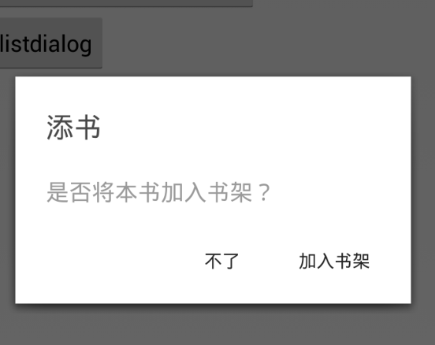
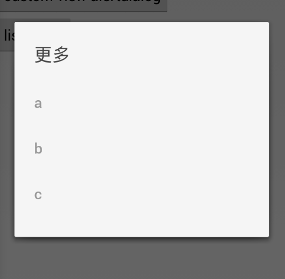

#DialogUpgrader

Make it easier to upgrader AlertDialog to Android L Dialog with one substitute. 

##Screenshot

##How to use

        new LDialogBuilder(this).setTitle(R.string.reader_add_book_title).setMessage(R.string.add_book_hint)
                .setPositiveButton(R.string.add_book, new DialogInterface.OnClickListener() {
                    @Override
                    public void onClick(DialogInterface dialog, int whichButton) {
                        dialog.dismiss();
                        finish();
                    }
                })
                .setNegativeButton(R.string.add_book_cancel, new DialogInterface.OnClickListener() {
                    @Override
                    public void onClick(DialogInterface dialog, int whichButton) {
                        dialog.dismiss();
                        finish();
                    }
                }).build().show();
                
                
                
You just need to replace the `new AlertDialog.Builder` in your current project with `new LDialogBuilder`, then you will got the lastest dialog style as in Android L.

##Thanks

[LDialog](https://github.com/lewisjdeane/L-Dialogs)